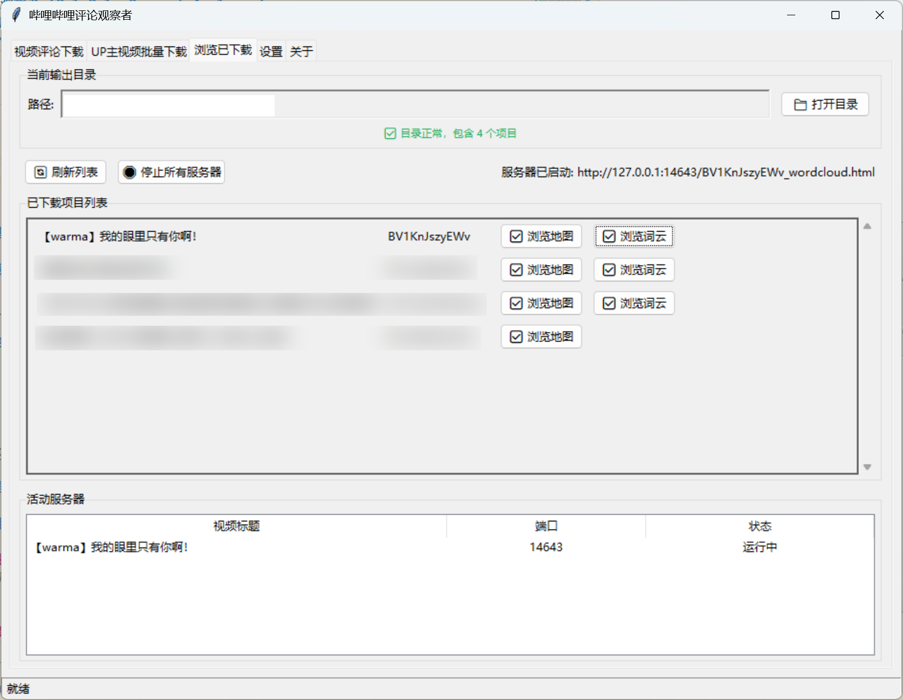

# 哔哩哔哩评论观察者 (BiliBili Comment Analyzer)

<div align="center">

[](LICENSE)
[](https://www.python.org/)
[](https://github.com/sansan0/bilibili-comment-analyzer)
[](https://github.com/sansan0/bilibili-comment-analyzer)

</div>
B 站（bilibili）评论数据分析下载器，提供完整的评论采集与可视化分析功能。支持单视频和 UP 主批量评论下载，具备评论地区分布地图生成、词云分析等功能。内置多维度数据筛选、本地 HTTP 服务器等特性，为 B 站内容创作者、数据分析师和吃瓜群众提供强大的评论数据洞察工具。

## 📋 目录

- [🔄 更新日志](#-更新日志)
- [✨ 核心功能](#-核心功能)
- [⚠️ 使用声明](#️-使用声明)
- [🚀 快速开始](#-快速开始)
- [📖 使用指南](#-使用指南)
- [⚙️ 配置说明](#️-配置说明)
- [📊 数据分析功能](#-数据分析功能)
- [📷 功能截图](#-功能截图)
- [❓ 常见问题](#-常见问题)
- [📞 交流方式](#-交流方式)
- [🙏 致谢](#-致谢)
- [📜 许可证](#-许可证)

## 🔄 更新日志

### v1.0.0 (2025-06-03)

**🎉 首次发布**

## ✨ 核心功能

### 🎯 数据采集

- **单视频评论下载**：支持 BV 号输入，获取完整评论数据
- **UP 主批量下载**：批量获取指定 UP 主的多个视频评论
- **图片资源下载**：自动提取并下载评论中的图片资源（评论区可能存在几个 GB 的图片数据，谨慎打开..）

### 📊 数据分析

- **地区分布地图**：基于 IP 属地生成中国省份分布热力图
- **词云分析**：智能分词，生成可交互的评论词云
- **多维筛选**：按地区、性别、等级进行数据筛选分析
- **统计洞察**：用户数、评论数、点赞数等关键指标统计

### 🔧 智能特性

- **二维码登录**：无需手动输入 Cookie，扫码即可登录
- **本地预览**：内置 HTTP 服务器，本地预览分析结果

## ⚠️ 使用声明

> **📢 重要提醒：请仔细阅读以下声明**

- 🎓 **本工具仅供学习和研究使用，请勿用于任何商业用途**
- 📋 **使用本工具时请遵守 B 站用户协议和相关法律法规**
- 🛡️ **请尊重创作者的劳动成果和知识产权，不得利用本工具侵犯他人权益**
- ⚡ **请合理使用本工具，避免频繁下载评论为自身账号造成风险**
- ⚖️ **使用本工具所产生的一切后果由用户自行承担**

**使用本工具即表示您已阅读、理解并同意遵守上述声明。**

## 🚀 快速开始

### 💻 安装方式

#### 方式一：直接下载可执行文件（推荐）

1. 前往 [Releases 页面](https://github.com/sansan0/bilibili-comment-analyzer/releases)
2. 下载最新版本的压缩包解压并打开其中的 `哔哩哔哩评论观察者.exe`
3. 双击运行即可使用

#### 方式二：从源码运行

```bash
# 克隆项目
git clone https://github.com/sansan0/bilibili-comment-analyzer.git
cd bilibili-comment-analyzer

# 安装Poetry（如果未安装）
pip install poetry

# 安装依赖
poetry install

# 运行程序
poetry run python run.py
```

## 📖 使用指南

### 🔑 登录配置

1. **启动应用** → **设置页面**
2. **点击【📱 扫码登录】**
3. **使用 B 站手机 APP 扫描二维码**
4. **确认登录，Cookie 自动保存**

> 💡 **提示**：Cookie 用于获取完整评论数据，请妥善保管，勿泄露给他人

### 📥 单视频评论下载

1. **切换到【视频评论下载】页面**
2. **输入 BV 号**（如：BVxxxxx）
   - 从视频链接提取：`https://www.bilibili.com/video/BVxxxxx/`
3. **选择评论排序方式**（按时间/点赞数/回复数）
4. **勾选【生成评论地区分布地图】**（推荐）
5. **点击【📥 获取评论】开始下载**

### 👤 UP 主批量下载

1. **切换到【UP 主视频批量下载】页面**
2. **输入 UP 主 ID**
   - 从 UP 主主页提取：`https://space.bilibili.com/123456`
3. **设置页面范围**
4. **选择视频和评论排序方式**
5. **点击【📥 获取评论】开始批量下载**

### 🌐 地图和词云生成

#### 从现有数据生成

- **【🌐 生成地图】**：从 CSV 文件生成地区分布地图
- **【☁️ 生成词云】**：从 CSV 文件生成交互式词云
- **【📥 获取图片】**：从 CSV 文件批量下载图片

#### 浏览分析结果

1. **切换到【浏览已下载】页面**
2. **点击对应项目的按钮**：
   - **【✅ 浏览地图】**：查看地区分布热力图
   - **【✅ 浏览词云】**：查看交互式词云分析

## ⚙️ 配置说明

### 🔧 基础设置

| 配置项       | 说明             | 默认值               | 建议值       |
| ------------ | ---------------- | -------------------- | ------------ |
| **Cookie**   | B 站登录凭证     | 空                   | 扫码登录获取 |
| **输出目录** | 数据保存位置     | `~/.BiCoDown/output` | 自定义路径   |
| **评论排序** | 默认排序方式     | 按点赞数             | 根据需求选择 |
| **生成地图** | 是否自动生成地图 | 是                   | 建议开启     |

## 📊 数据分析功能

### 🗺️ 地区分布地图

**功能特点**：

- 基于评论者 IP 属地生成中国省份热力图
- 支持按评论数、用户数、点赞数多维度展示
- 交互式地图，支持缩放和悬停查看详情
- 自动识别和统计未匹配地区

**支持的地区维度**：

- 📊 评论数量统计
- 👥 独立用户数统计
- ❤️ 总点赞数统计
- ⚡ 男女用户比例
- 🎯 用户等级分布

### ☁️ 词云分析

**智能分词功能**：

- 使用 pkuseg 中文分词引擎
- 自动过滤停用词和无意义词汇
- 智能识别和保留表情符号
- 支持自定义停用词表

**多维度筛选**：

- 🌍 **按地区筛选**：查看特定地区用户的评论词云
- 👤 **按性别筛选**：分析不同性别用户的关注点
- 🏆 **按等级筛选**：了解不同等级用户的评论特点
- 📈 **实时统计**：动态显示筛选后的数据统计

**可视化特性**：

- 动态词云大小调整
- 高频词汇突出显示
- 支持词汇点击查看详情
- 响应式设计，适配不同屏幕

### 📈 统计分析

**用户行为分析**：

- 评论活跃度分布
- 用户等级构成比例
- 地域用户参与度对比
- 性别比例统计

**内容质量分析**：

- 高赞评论特征分析
- 回复互动热度统计
- 表情使用频率统计
- 评论长度分布分析

## 📷 功能截图

### 主界面概览


### 实时浏览



### 地区分布地图


### 词云分析


## ❓ 常见问题

### 🔐 登录相关

**Q：为什么需要登录？**  
A：登录后可以获取完整的评论数据，包括用户等级、IP 属地等信息。未登录状态下部分数据可能无法获取。

**Q：Cookie 是否安全？**  
A：Cookie 仅在本地存储，不会上传到任何服务器。请注意保护好你的 Cookie，不要泄露给他人。

**Q：二维码登录失败怎么办？**  
A：请确保网络连接正常，使用最新版本的 B 站手机 APP 扫码。如仍失败，可尝试手动获取 Cookie 填入。

### 📥 下载相关

**Q：下载速度很慢怎么办？**  
A：可以在设置中适当降低请求延迟，但注意不要设置过小以免账号产生风险。建议批量下载时使用较大延迟确保稳定性。

### 📊 分析相关

**Q：为什么有些地区显示"未匹配"？**  
A：B 站的 IP 属地数据可能包含一些特殊地区名称，程序会尽力匹配到标准省份名称，未匹配的会单独统计。

**Q：词云为什么没有显示某些词汇？**  
A：程序会自动过滤停用词、短词和无意义词汇。你可以查看停用词文件 **stopwords.txt** 进行自定义调整。

**Q：当前分词效果有些一般？**  
A：我默认打包了较小的模型，不然一个压缩包几百兆太大了，你可以访问 https://github.com/lancopku/pkuseg-python 下载 releases 中的模型，解压覆盖到 web 目录就行。

## 📞 交流方式

### 👨‍💻 作者信息

- **作者**：sansan
- **GitHub**：[@sansan0](https://github.com/sansan0)
- **项目主页**：[bilibili-comment-analyzer](https://github.com/sansan0/bilibili-comment-analyzer)

### 💬 社区交流与问题反馈

**扫码关注作者微信公众号，以支持作者的幸苦开发，也可以更快的反馈使用问题：**


---

## 🙏 致谢

感谢以下开源项目和工具：

- [pkuseg-python](https://github.com/lancopku/pkuseg-python) - 北京大学开源的中文分词工具，为本项目的词云分析提供了强大的分词支持
- [spacy-pkuseg](https://github.com/explosion/spacy-pkuseg) - 非常谢谢，虽然自用 pkuseg-python 没问题，但没有这个项目，打包给其它用户就不行了
- [blblcd](https://github.com/WShihan/blblcd) - 为本项目的数据结构设计提供了参考和灵感
- [bilibili-API-collect](https://github.com/SocialSisterYi/bilibili-API-collect) - 为本项目的 B 站 API 调用提供了参考
- [ai-code-context-helper](https://github.com/sansan0/ai-code-context-helper) - 为本项目加速开发提供了助力(哈哈自卖自夸，自己写的小工具)

## 📜 许可证

本项目采用 GPL-3.0 许可证 - 详见 [LICENSE](LICENSE) 文件。

---

<div align="center">

**⭐ 如果这个项目对你有帮助，请给它一个 Star！**

[🔝 回到顶部](#哔哩哔哩评论观察者-bilibili-comment-analyzer)

</div>
