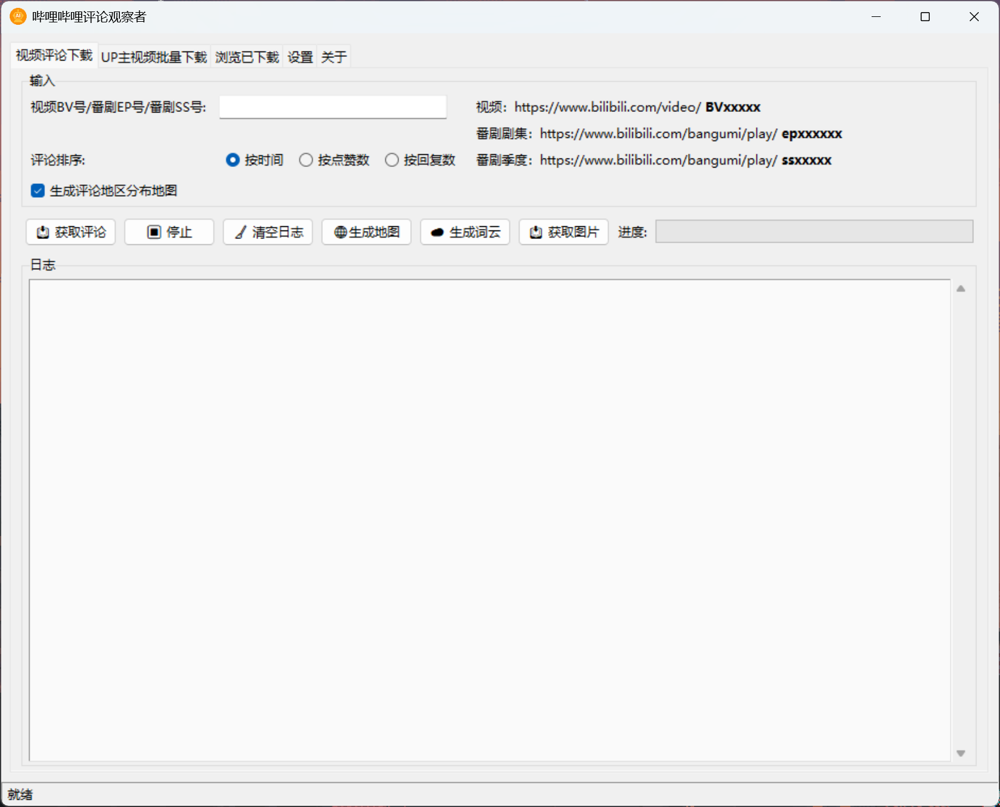

# 哔哩哔哩评论观察者 (BiliBili Comment Analyzer)

<div align="center">

[](LICENSE)
[](https://www.python.org/)
[](https://github.com/sansan0/bilibili-comment-analyzer)
[](https://github.com/sansan0/bilibili-comment-analyzer)

</div>

一个专业的 B 站评论数据分析工具，帮你挖掘评论区背后的故事。无论你是内容创作者、数据研究者，还是单纯的好奇宝宝，都能从中发现有趣的洞察。本工具仅供个人学习和研究使用。

## 📋 功能截图

### 主界面概览



### 地区分布热力图


### 智能词云分析


## 🎯 这个工具能解决什么问题？

**📺 内容创作者的困惑：**

- 我的视频在不同地区的反响如何？哪里的观众更活跃？
- 评论区大家都在聊什么？哪些话题最火？
- 不同时期发布的内容，观众反应有什么变化趋势？
- 如何基于数据优化内容策略，提升互动效果？

**📊 数据爱好者的需求：**

- 想研究网络文化和地域差异在评论中的体现
- 需要大量真实的用户行为数据做分析
- 希望了解不同群体的兴趣偏好和表达习惯
- 想要可视化展示复杂的社交媒体数据

**🔍 吃瓜群众的好奇：**

- 这个视频为什么这么火？各地网友都是什么反应？
- 想看看自己关注的 UP 主粉丝都来自哪里
- 好奇热门事件在不同地区的讨论差异
- 想了解网络热梗的传播轨迹

**🏢 运营和媒体工作者：**

- 分析品牌或产品在不同地区的口碑差异
- 研究舆情传播规律和用户画像
- 监测内容营销效果和用户反馈
- 发现潜在的市场机会和风险点

## 🔄 更新日志

### v1.1.0 (2025-06-14)

1. 词云增加根据筛选条件一键复制评论的功能，感谢@潇湘 在公众号的支持而开发

### v1.0.0 (2025-06-04)

🎉 首次发布

## ✨ 核心功能

- **单视频深度分析** - 支持 BV 号、EP 号、SS 号，完整获取评论数据
- **UP 主批量分析** - 一键分析多个视频内容
- **全国热力地图** - 基于 IP 属地生成省份级评论分布图
- **多维度统计** - 按评论数、用户数、点赞数展示地域差异
- **交互式探索** - 支持缩放、悬停的动态地图体验
- **智能词云生成** - 中文分词技术提取评论关键词
- **灵活筛选维度** - 按地区、性别、等级查看不同群体关注点
- **实时数据面板** - 动态展示筛选后的用户画像统计
- **内置本地服务** - 无需部署即可预览所有分析结果
- **标准化导出** - CSV 格式保存完整数据，支持二次分析

## 🚀 快速开始

### 方式一：直接运行（推荐）

1. 前往 [Releases 页面](https://github.com/sansan0/bilibili-comment-analyzer/releases) 下载最新版本
2. 解压后双击运行 `哔哩哔哩评论观察者.exe`

### 方式二：源码运行

```bash
git clone https://github.com/sansan0/bilibili-comment-analyzer.git
cd bilibili-comment-analyzer
pip install poetry
poetry install
poetry run python run.py
```

## 📖 使用指南

### 🔑 账号登录设置

进入「设置」页面，点击「扫码登录」，使用 B 站手机 APP 扫描二维码。

### 🎬 单视频分析流程

1. 切换到「视频评论下载」页面
2. 输入目标内容：
   - 视频：BV 号（如 BV1xx411c7mD）
   - 番剧：EP 号（如 EP123456）或 SS 号
   - 支持直接粘贴完整链接
3. 选择评论排序方式（按时间/点赞数/回复数）
4. 勾选「生成评论地区分布地图」
5. 点击「获取评论」开始分析

### 👤 UP 主批量分析

1. 进入「UP 主视频批量下载」页面
2. 输入 UP 主 ID（从 space.bilibili.com/数字 中获取）
3. 设置页面范围（建议初次使用选择 1-3 页）
4. 选择视频排序（最新发布/最多播放/最多收藏）
5. 开始批量分析多个视频

### 🌐 查看分析结果

在「浏览已下载」页面可以：

- 浏览地图 - 查看地域分布热力图
- 浏览词云 - 探索热门话题和关键词
- 管理本地 HTTP 服务器状态

### 🛠️ 从现有数据生成内容

- **生成地图** - 从 CSV 文件重新生成地区分布图
- **生成词云** - 基于已有数据创建词云分析
- **获取图片** - 批量下载评论中的图片资源

## ❓ 常见问题

### 🔐 登录相关

**Q：为什么需要登录？**  
A：登录后可以获取完整的评论数据，包括用户等级、IP 属地等信息。未登录状态下部分数据可能无法获取。

**Q：Cookie 是否安全？**  
A：Cookie 仅在本地存储，不会上传到任何服务器。请注意保护好你的 Cookie，不要泄露给他人。

**Q：二维码登录失败怎么办？**  
A：请确保网络连接正常，使用最新版本的 B 站手机 APP 扫码。如仍失败，可尝试手动获取 Cookie 填入。

### 📊 分析相关

**Q：词云为什么没有显示某些词汇？**  
A：程序会自动过滤停用词、短词和无意义词汇。你可以查看停用词文件 **stopwords.txt** 进行自定义调整。

**Q：当前分词效果有些一般？**  
A：我默认打包了较小的模型，不然一个压缩包几百兆挺大的，你可以访问 https://github.com/lancopku/pkuseg-python 下载 releases 中的模型，默认推荐 [default_v2](https://github.com/lancopku/pkuseg-python/releases/download/v0.0.25/default_v2.zip) 模型，解压覆盖到 web 目录就行。

## 📧 学习交流

扫码关注微信公众号，里面有文章是讲我写的这些项目的，咳如果对你有了点帮助，献上【点赞,转发,推荐】三连，就算支持了俺这个作者的开发了，顺便也可以反馈使用问题：

<div align="center">


</div>


## ⚠️ 使用声明

> [!CAUTION]  
> **使用本工具即表示您明确知晓并同意免责声明里的内容：**

<details>
<summary> 点击查看 - 免责声明 </summary>

1.  本工具仅作为技术研究和教育展示，不鼓励、不支持任何实际使用
2.  开发者不对工具的合法性作任何保证，不承担用户使用的任何法律后果
3.  本工具为技术中立工具，使用者需对其使用行为承担全部法律责任
4.  如收到平台方或监管部门要求，将立即停止提供和维护本工具

本工具**严禁**用于以下任何场景：

- 任何商业用途或营利活动
- 大规模或自动化数据采集
- 侵犯他人隐私权或个人信息
- 违反平台服务条款的行为
- 任何可能违反中国法律法规的用途

1.  您完全了解并自愿承担所有可能的法律风险，包括但不限于刑事责任、行政处罚、民事赔偿
2.  您有义务确保使用行为完全符合所有适用的法律法规和平台规则
3.  您承诺在使用前已咨询专业法律意见，并获得明确的合规指导
4.  因您的使用行为导致的任何法律后果，您承诺承担全部责任并赔偿相关损失
</details>

**如您决定继续使用本工具，即表示您已充分理解并愿意承担所有风险。**

## 🙏 开发致谢

感谢以下开源项目的支持：

- [pkuseg-python](https://github.com/lancopku/pkuseg-python) - 北京大学开源的中文分词工具，为本项目的词云分析提供了强大的分词支持
- [spacy-pkuseg](https://github.com/explosion/spacy-pkuseg) - 非常谢谢，虽然自用 pkuseg-python 没问题，但没有这个项目，打包给其它用户就不行了
- [blblcd](https://github.com/WShihan/blblcd) - 为本项目的数据结构设计提供了参考和灵感
- [bilibili-API-collect](https://github.com/SocialSisterYi/bilibili-API-collect) - 为本项目的 B 站 API 调用提供了参考
- [ai-code-context-helper](https://github.com/sansan0/ai-code-context-helper) - 为本项目加速开发提供了助力(哈哈自卖自夸，自己写的小工具)

## 📜 许可协议

本项目采用 GPL-3.0 许可证 - 详见 [LICENSE](LICENSE) 文件。

---

<div align="center">

**⭐ 如果这个工具对你有帮助，请给项目点个 Star 支持开发！**

[🔝 回到顶部](#哔哩哔哩评论观察者-bilibili-comment-analyzer)

</div>
