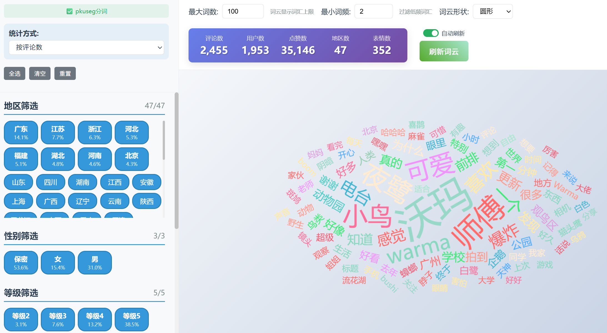

# 哔哩哔哩评论观察者 (BiliBili Comment Analyzer)

<div align="center">

[](LICENSE)
[](https://www.python.org/)
[](https://github.com/sansan0/bilibili-comment-analyzer)
[](https://github.com/sansan0/bilibili-comment-analyzer)

</div>

一个专业的 B 站评论数据分析工具，帮你挖掘评论区背后的故事。无论你是内容创作者、数据研究者，还是单纯的好奇宝宝，都能从中发现有趣的洞察。

## 📋 功能截图

### 主界面概览


### 地区分布热力图


### 智能词云分析



## 🎯 这个工具能解决什么问题？

**📺 内容创作者的困惑：**

- 我的视频在不同地区的反响如何？哪里的观众更活跃？
- 评论区大家都在聊什么？哪些话题最火？
- 不同时期发布的内容，观众反应有什么变化趋势？
- 如何基于数据优化内容策略，提升互动效果？

**📊 数据爱好者的需求：**

- 想研究网络文化和地域差异在评论中的体现
- 需要大量真实的用户行为数据做分析
- 希望了解不同群体的兴趣偏好和表达习惯
- 想要可视化展示复杂的社交媒体数据

**🔍 吃瓜群众的好奇：**

- 这个视频为什么这么火？各地网友都是什么反应？
- 想看看自己关注的 UP 主粉丝都来自哪里
- 好奇热门事件在不同地区的讨论差异
- 想了解网络热梗的传播轨迹

**🏢 运营和媒体工作者：**

- 分析品牌或产品在不同地区的口碑差异
- 研究舆情传播规律和用户画像
- 监测内容营销效果和用户反馈
- 发现潜在的市场机会和风险点

## 🔄 更新日志

> 我在想要不要像 b 站 up 一样，项目达到多少 star， 我就做一个大功能放上去？嘿嘿，不过感觉就这速度 100 个 star 都要好久

### v1.0.0 (2025-06-04)

🎉 首次发布

## ✨ 核心功能

### 智能数据采集

- **单视频深度分析** - 支持 BV 号、EP 号、SS 号，完整获取评论数据
- **UP 主批量分析** - 一键分析指定 UP 主的多个视频内容
- **自动去重补全** - 智能处理重复评论，获取完整的子评论链

### 地域分布洞察

- **全国热力地图** - 基于 IP 属地生成省份级评论分布图
- **多维度统计** - 按评论数、用户数、点赞数展示地域差异
- **交互式探索** - 支持缩放、悬停的动态地图体验

### 内容趋势分析

- **智能词云生成** - 中文分词技术提取评论关键词
- **灵活筛选维度** - 按地区、性别、等级查看不同群体关注点
- **实时数据面板** - 动态展示筛选后的用户画像统计

### 便捷预览体验

- **内置本地服务** - 无需部署即可预览所有分析结果
- **一键批量生成** - 同时创建地图、词云等分析内容
- **标准化导出** - CSV 格式保存完整数据，支持二次分析

## 🚀 快速开始

### 方式一：直接运行（推荐）

1. 前往 [Releases 页面](https://github.com/sansan0/bilibili-comment-analyzer/releases) 下载最新版本
2. 解压后双击运行 `哔哩哔哩评论观察者.exe`

### 方式二：源码运行

```bash
git clone https://github.com/sansan0/bilibili-comment-analyzer.git
cd bilibili-comment-analyzer
pip install poetry
poetry install
poetry run python run.py
```

## 📖 使用指南

### 🔑 账号登录设置

进入「设置」页面，点击「扫码登录」，使用 B 站手机 APP 扫描二维码。登录后可获取更完整的评论数据，包括用户等级、IP 属地等详细信息。

### 🎬 单视频分析流程

1. 切换到「视频评论下载」页面
2. 输入目标内容：
   - 视频：BV 号（如 BV1xx411c7mD）
   - 番剧：EP 号（如 EP123456）或 SS 号
   - 支持直接粘贴完整链接
3. 选择评论排序方式（按时间/点赞数/回复数）
4. 勾选「生成评论地区分布地图」
5. 点击「获取评论」开始分析

### 👤 UP 主批量分析

1. 进入「UP 主视频批量下载」页面
2. 输入 UP 主 ID（从 space.bilibili.com/数字 中获取）
3. 设置页面范围（建议初次使用选择 1-3 页）
4. 选择视频排序（最新发布/最多播放/最多收藏）
5. 开始批量分析多个视频

### 🌐 查看分析结果

在「浏览已下载」页面可以：

- 浏览地图 - 查看地域分布热力图
- 浏览词云 - 探索热门话题和关键词
- 管理本地 HTTP 服务器状态

## 💡 高级功能

### 🛠️ 从现有数据生成内容

- **生成地图** - 从 CSV 文件重新生成地区分布图
- **生成词云** - 基于已有数据创建词云分析
- **获取图片** - 批量下载评论中的图片资源

### 🔧 技术特色

- **智能反爬虫策略** - 模拟真实用户行为，稳定可靠
- **中文分词优化** - 集成 pkuseg 分词库，精确识别中文词汇
- **地理数据标准化** - 自动处理各种 IP 属地表达格式
- **高性能处理** - 支持大数据量分析，内置智能缓存
- **跨平台兼容** - 完美支持 Windows、macOS、Linux

## ❓ 常见问题

**Q: 为什么需要登录 B 站账号？**
A: 登录后可获取完整的评论数据，包括用户等级、IP 属地等信息。未登录状态下部分数据可能无法获取。

**Q: 如何提升词云分析的准确性？**
A: 程序默认使用轻量级分词模型，你可以访问 [pkuseg 项目](https://github.com/lancopku/pkuseg-python) 下载更大的模型文件来提升效果。

**Q: 处理大量数据时有什么建议？**
A: 建议先测试小范围数据（如 1-2 页视频），确认效果后再扩大分析范围。程序支持断点续传和增量更新。

**Q: 生成的地图为什么有些地区显示"未匹配"？**
A: B 站 IP 属地可能包含特殊地区名称，程序会尽力匹配到标准省份，未匹配的会单独统计显示。

## ⚠️ 使用声明

本工具专为学习研究设计，请务必遵守以下原则：

- 仅用于学术研究和个人分析，禁止商业用途
- 遵守 B 站用户协议和相关法律法规
- 尊重内容创作者权益，合理使用数据
- ⚡ 控制请求频率，避免对服务器造成压力

## 🙏 开发致谢

感谢以下开源项目的支持：

- [pkuseg-python](https://github.com/lancopku/pkuseg-python) - 北京大学开源的中文分词工具，为本项目的词云分析提供了强大的分词支持
- [spacy-pkuseg](https://github.com/explosion/spacy-pkuseg) - 非常谢谢，虽然自用 pkuseg-python 没问题，但没有这个项目，打包给其它用户就不行了
- [blblcd](https://github.com/WShihan/blblcd) - 为本项目的数据结构设计提供了参考和灵感
- [bilibili-API-collect](https://github.com/SocialSisterYi/bilibili-API-collect) - 为本项目的 B 站 API 调用提供了参考
- [ai-code-context-helper](https://github.com/sansan0/ai-code-context-helper) - 为本项目加速开发提供了助力(哈哈自卖自夸，自己写的小工具)

## 📧 问题反馈

扫码关注作者微信公众号，获取使用帮助和问题反馈：


## 📜 许可协议

本项目采用 GPL-3.0 许可证 - 详见 [LICENSE](LICENSE) 文件。

---

<div align="center">

**⭐ 如果这个工具对你有帮助，请给项目点个 Star 支持开发！**

[🔝 回到顶部](#哔哩哔哩评论观察者-bilibili-comment-analyzer)

</div>
